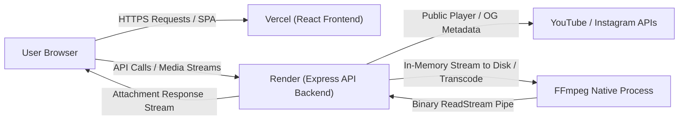

# InTube Deployment Guide: Vercel & Render

This guide explains how to deploy the InTube application in production using **Vercel** (Frontend) and **Render** (Backend).

The architecture is intentionally **stateless and serverless-friendly**:
- **Zero Database Requirements**: No MongoDB, PostgreSQL, Redis, or BullMQ needed.
- **Zero Permanent Media Storage**: Media is processed in ephemeral temp directories and streamed directly to users, with guaranteed cleanup.
- **Zero User Authentication**: Fully public media utility without logins, sessions, or account tracking.

---

## 1. Architecture Overview



---

## 2. Frontend Deployment: Vercel

### 2.1 Configuration Settings
1. Go to the [Vercel Dashboard](https://vercel.com/dashboard) and click **Add New Project**.
2. Connect your Git repository.
3. Configure the project settings:
   - **Framework Preset**: `Vite`
   - **Root Directory**: `client`
   - **Build Command**: `npm run build`
   - **Output Directory**: `dist`
   - **Install Command**: `npm install`

### 2.2 Environment Variables (Vercel)
Add the following variable in the Vercel Project Settings under **Environment Variables**:

| Variable Name | Value | Description |
| :--- | :--- | :--- |
| `VITE_API_BASE_URL` | `https://your-render-backend.onrender.com/api/v1` | URL pointing to your deployed Render backend API |

### 2.3 Single-Page Application (SPA) Routing
The `client/vercel.json` file is pre-configured with URL rewrites to prevent 404 errors on direct navigation to subpages:
```json
{
  "rewrites": [
    {
      "source": "/(.*)",
      "destination": "/index.html"
    }
  ]
}
```

---

## 3. Backend Deployment: Render

### 3.1 Deployment Option A: Automatic Blueprint (Recommended)
The repository contains a root `render.yaml` file.
1. Go to the [Render Dashboard](https://dashboard.render.com/) and navigate to **Blueprints**.
2. Connect your repository. Render will automatically configure the `intube-backend` Web Service.
3. In the Web Service settings, set the `FRONTEND_URL` environment variable to your Vercel deployment URL (e.g. `https://your-intube-app.vercel.app`).

### 3.2 Deployment Option B: Manual Web Service Setup
1. Create a new **Web Service** in Render.
2. Configure settings:
   - **Name**: `intube-backend`
   - **Runtime**: `Node`
   - **Region**: `Oregon` or closest to your target audience
   - **Branch**: `main`
   - **Build Command**: `npm install --prefix server`
   - **Start Command**: `npm start --prefix server`
   - **Plan**: `Free`

### 3.3 Environment Variables (Render)

| Variable Name | Recommended Production Value | Description |
| :--- | :--- | :--- |
| `NODE_ENV` | `production` | Enables production optimizations & security policies |
| `PORT` | `5000` (or leave default, Render sets `PORT` automatically) | HTTP listening port |
| `FRONTEND_URL` | `https://your-app.vercel.app` | **Critical**: Configures CORS to permit your Vercel frontend |
| `MAX_FILE_SIZE_MB` | `100` | Maximum media file size allowed for processing |
| `MAX_PROCESSING_TIME_MS`| `120000` (2 minutes) | Hard execution timeout for FFmpeg operations |
| `MAX_TEMP_STORAGE_MB` | `512` | Ephemeral disk safety limit |
| `MAX_CONCURRENT_JOBS` | `5` | Maximum parallel transcoding jobs |
| `RATE_LIMIT_WINDOW_MS` | `900000` (15 minutes) | Rate limiting calculation window |
| `RATE_LIMIT_MAX_REQUESTS`| `100` | Max overall requests per IP in rate window |
| `DOWNLOAD_RATE_LIMIT_MAX`| `20` | Max download operations per IP in rate window |
| `TEMP_DIR` | `/tmp/intube` | Ephemeral directory path |
| `LOG_LEVEL` | `info` | Logging verbosity (`error`, `warn`, `info`, `debug`) |

---

## 4. Platform & Free-Tier Specifics

### 4.1 Render Free-Tier Characteristics
- **Cold Starts**: Render free-tier web services spin down after 15 minutes of inactivity. The first incoming request may take ~30–50 seconds to wake the service.
  - *Tip*: The InTube frontend automatically displays a friendly connecting state when waiting on a cold-starting backend.
- **512 MB RAM Ceiling**: InTube is optimized specifically for low-memory environments. Files are **never** loaded into memory buffers; they stream directly between disk and the HTTP socket.
- **Ephemeral `/tmp` Filesystem**: Render provides an ephemeral filesystem on `/tmp`. InTube creates isolated UUID folders under `/tmp/intube/<uuid>` and cleans them up immediately after streaming finishes.

### 4.2 FFmpeg on Render
- Render's native Node.js Linux container includes `ffmpeg` pre-installed in `/usr/bin/ffmpeg`.
- InTube automatically detects system `ffmpeg` from `PATH`. No custom binary builds or external dependencies are required.

### 4.3 CORS Configuration
- In production (`NODE_ENV=production`), the backend checks incoming `Origin` headers strictly against `FRONTEND_URL`.
- If you change your Vercel custom domain, update `FRONTEND_URL` in the Render dashboard accordingly.

---

## 5. Health Check & Monitoring

- **Health Endpoint**: `GET https://your-backend.onrender.com/api/v1/health`
- Render Health Check Path: `/api/v1/health`
- The health endpoint returns JSON telemetry including active providers, Node.js version, uptime, and current heap memory usage without consuming rate limits.
