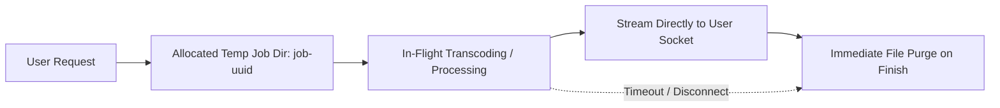

# Privacy by Design Architecture

InTube is engineered from the ground up with a strict **stateless, privacy-first model**. This document outlines our data lifecycle, security guarantees, and technical design decisions.

---

## Core Privacy Guarantees

1. **Zero User Accounts**: No registration, login, email collection, or user database.
2. **Zero Permanent Media Storage**: Media files are processed purely in ephemeral temporary job directories and purged immediately.
3. **No Activity / Download Logging**: Server access logs are sanitized to exclude URLs, search queries, auth tokens, and personally identifiable information.
4. **No Third-Party Trackers**: Zero advertising networks, tracking pixels, or invasive telemetry.

---

## Data Lifecycle & Ephemeral Processing

### Temporary File Management (`TempFileManager`)
- Each conversion job executes inside an isolated subdirectory `/tmp/job-<uuid>`.
- In-flight active jobs are tracked in-memory to prevent premature deletion during transcoding.
- An automatic background sweep runs every 5 minutes and permanently removes any orphaned job directories older than 10 minutes (TTL 600s).
- Immediate cleanup triggers on:
  1. Stream completion (`finish` event)
  2. Client socket disconnection (`close` / `aborted` event)
  3. Processing errors

---

## QR Mobile Transfer Security
- Ephemeral transfer tokens are 64-character cryptographically secure hex strings generated via `crypto.randomBytes(32)`.
- Tokens expire strictly after 10 minutes.
- Once downloaded or expired, the underlying file payload is deleted from the filesystem.

---

## Local Storage Usage
The client browser `localStorage` is used solely for:
- `intube-theme`: User theme preference (`'dark'` or `'light'`).
- `intube_download_preset`: Selected download preset (`'smart'`, `'best_quality'`, `'mobile'`, `'audio'`, `'small_file'`).

No personal identification or browsing history is stored.
